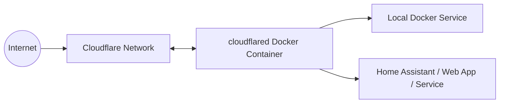
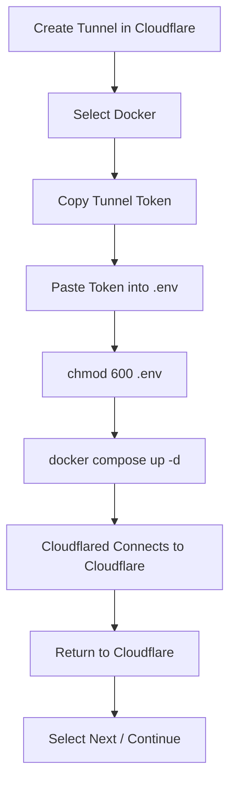

<div align="center">

# ☁️ Cloudflare Tunnel with Docker Compose


**Deploy `cloudflared` as a Docker container and connect it to a remotely managed Cloudflare Tunnel.**


</div>

---

## 📋 Table of Contents

- [Overview](#-overview)
- [How It Works](#-how-it-works)
- [Prerequisites](#-prerequisites)
- [1. Change to the `/otp` Directory](#1-change-to-the-otp-directory)
- [2. Clone the Repository](#2-clone-the-repository)
- [3. Create the `.env` File](#3-create-the-env-file)
- [4. Create a Cloudflare Tunnel](#4-create-a-cloudflare-tunnel)
- [5. Select Docker and Copy the Tunnel Token](#5-select-docker-and-copy-the-tunnel-token)
- [6. Add the Token to `.env`](#6-add-the-token-to-env)
- [7. Protect the `.env` File](#7-protect-the-env-file)
- [8. Start the Container](#8-start-the-container)
- [9. Return to Cloudflare and Continue](#9-return-to-cloudflare-and-continue)
- [10. Verify the Container](#10-verify-the-container)
- [11. Configure a Published Application](#11-configure-a-published-application)
- [Updating cloudflared](#-updating-cloudflared)
- [Troubleshooting](#-troubleshooting)
- [Security Notes](#-security-notes)

---

## 🔎 Overview

Cloudflare Tunnel allows you to publish services running on your private network without opening inbound ports on your router or firewall.

The `cloudflared` container creates an **outbound encrypted connection** from your Docker host to Cloudflare.



> [!IMPORTANT]
> This guide uses a **remotely managed Cloudflare Tunnel**. The tunnel configuration is managed from the Cloudflare dashboard and the Docker container authenticates by using a tunnel token.

---

## ✅ Prerequisites

Before beginning, make sure the server has:

- Linux
- Docker Engine
- Docker Compose
- Git
- Nano
- Internet access
- A Cloudflare account
- A domain managed by Cloudflare
- Permission to create Cloudflare Tunnels

Verify Docker:

```bash
docker --version
```

Verify Docker Compose:

```bash
docker compose version
```

Verify Git:

```bash
git --version
```

---

# 1. Change to the `/otp` Directory

Change to the directory where the repository will be stored:

```bash
cd /otp
```

If `/otp` does not already exist:

```bash
sudo mkdir -p /otp
sudo chown "$USER":"$USER" /otp
cd /otp
```

> [!NOTE]
> `/opt` is the more common Linux directory for optional application software. This README uses `/otp` because that is the requested installation path. If `/opt` was intended, replace `/otp` with `/opt` throughout the commands.

---

# 2. Clone the Repository

Clone your Cloudflare `cloudflared` Docker Compose repository.

```bash
git clone https://github.com/<YOUR_GITHUB_USERNAME>/<YOUR_REPOSITORY>.git
```

Example:

```bash
git clone https://github.com/s0nt3k/cloudflared.git
```

Enter the repository directory:

```bash
cd cloudflared
```

Confirm the files are present:

```bash
ls -la
```

You should see files similar to:

```text
.
├── compose.yaml
├── example.env
├── .gitignore
└── README.md
```

---

# 3. Create the `.env` File

The repository should contain an example environment file named:

```text
example.env
```

Copy it to `.env`:

```bash
cp example.env .env
```

Confirm it exists:

```bash
ls -la
```

You should now see:

```text
.env
example.env
```

A typical `example.env` contains:

```dotenv
CLOUDFLARED_TOKEN=PASTE_YOUR_CLOUDFLARE_TUNNEL_TOKEN_HERE
```

> [!CAUTION]
> Never put the real Cloudflare tunnel token inside `example.env`. The example file may be committed to Git; `.env` should not be.

---

# 4. Create a Cloudflare Tunnel

Open the Cloudflare dashboard in your browser:

**Cloudflare Dashboard → Networking → Tunnels**

Then:

1. Select **Create a tunnel**.
2. Select **Cloudflared** if Cloudflare asks which connector type to use.
3. Enter a descriptive tunnel name.

Examples:

```text
docker-server
home-lab
production-docker
home-assistant
sontek-services
```

4. Select **Save tunnel** or **Create Tunnel**, depending on the wording displayed in the dashboard.

Cloudflare will now display instructions for connecting a connector to the tunnel.

---

# 5. Select Docker and Copy the Tunnel Token

Under the connector installation options:

1. Select **Docker** as the operating environment.
2. Cloudflare will display a Docker command similar to:

```bash
docker run cloudflare/cloudflared:latest tunnel --no-autoupdate run --token eyJhIjoiXXXXXXXXXXXXXXXXXXXXXXXX
```

3. Use Cloudflare's **Copy** button to copy the command.

The portion after:

```text
--token
```

is your tunnel token.

For example:

```text
eyJhIjoiXXXXXXXXXXXXXXXXXXXXXXXX
```

> [!WARNING]
> **Do not publish, screenshot, email, or commit your real tunnel token.**
>
> A Cloudflare Tunnel token is a credential. Anyone possessing the token may be able to run a connector for that tunnel.

### What You Need to Copy

From:

```bash
docker run cloudflare/cloudflared:latest tunnel --no-autoupdate run --token eyJhIjoiABC123EXAMPLE
```

you only need:

```text
eyJhIjoiABC123EXAMPLE
```

---

# 6. Add the Token to `.env`

Return to your Linux server terminal.

Open `.env` with Nano:

```bash
nano .env
```

You should see something similar to:

```dotenv
CLOUDFLARED_TOKEN=PASTE_YOUR_CLOUDFLARE_TUNNEL_TOKEN_HERE
```

Replace the placeholder with the token copied from Cloudflare:

```dotenv
CLOUDFLARED_TOKEN=eyJhIjoiABC123EXAMPLE
```

Do **not** add spaces around the `=` sign.

Correct:

```dotenv
CLOUDFLARED_TOKEN=eyJhIjoiABC123EXAMPLE
```

Incorrect:

```dotenv
CLOUDFLARED_TOKEN = eyJhIjoiABC123EXAMPLE
```

## ⌨️ Nano Keyboard Shortcuts

After pasting the token:

| Action | Keyboard Shortcut |
|---|---|
| Save / Write Out | `Ctrl` + `O` |
| Confirm Filename | `Enter` |
| Exit Nano | `Ctrl` + `X` |

The complete sequence is:

```text
Ctrl + O
Enter
Ctrl + X
```

> [!TIP]
> In Nano, the `^` symbol means the **Ctrl** key. Therefore `^O` means `Ctrl + O`.

---

# 7. Protect the `.env` File

Restrict `.env` so only its owner can read and write the file:

```bash
chmod 600 .env
```

Verify the permissions:

```bash
ls -l .env
```

Expected output should begin with:

```text
-rw-------
```

This means:

```text
Owner:  Read + Write
Group:  No Access
Others: No Access
```

You can also verify numerically:

```bash
stat -c "%a %n" .env
```

Expected result:

```text
600 .env
```

## Verify `.env` Is Ignored by Git

Your `.gitignore` should contain:

```gitignore
.env
```

Check:

```bash
cat .gitignore
```

Then verify Git is not tracking `.env`:

```bash
git status
```

The `.env` file should **not** appear as a file waiting to be committed.

---

# 8. Start the Container

Start `cloudflared` in detached mode:

```bash
docker compose up -d
```

Docker Compose will:

1. Read `compose.yaml`.
2. Load the token from `.env`.
3. Pull the Cloudflare `cloudflared` image if necessary.
4. Create the container.
5. Start the Cloudflare Tunnel connector.

Example Compose configuration:

```yaml
services:
  cloudflared:
    image: cloudflare/cloudflared:latest
    container_name: cloudflared
    restart: unless-stopped
    command: tunnel --no-autoupdate run --token ${CLOUDFLARED_TOKEN}
```

---

# 9. Return to Cloudflare and Continue

After starting the container:

1. Return to the Cloudflare Tunnel setup page in your browser.
2. Wait for Cloudflare to detect the connector.
3. The connector/tunnel should change to a **Connected** or **Healthy** state.
4. Select **Next** or **Continue**.



---

# 10. Verify the Container

Check whether the container is running:

```bash
docker compose ps
```

You can also use:

```bash
docker ps
```

Expected status:

```text
Up
```

View the tunnel logs:

```bash
docker compose logs cloudflared
```

Follow the logs in real time:

```bash
docker compose logs -f cloudflared
```

Press:

```text
Ctrl + C
```

to stop following the logs. This does **not** stop the container.

---

# 11. Configure a Published Application

After Cloudflare detects the tunnel, configure the service you want to publish.

In the Cloudflare dashboard, select the tunnel and add a **Published application** route.

Example:

| Setting | Example |
|---|---|
| Subdomain | `homeassistant` |
| Domain | `example.com` |
| Type | `HTTP` |
| URL | `homeassistant:8123` |

This would create:

```text
https://homeassistant.example.com
```

and send the traffic through the Cloudflare Tunnel to:

```text
http://homeassistant:8123
```

> [!IMPORTANT]
> If `cloudflared` and the destination application are separate Docker containers, they normally need access to a common Docker network for container-name DNS such as `homeassistant:8123` to work.

Another example:

```text
Public Hostname:
https://portainer.example.com

Service:
https://portainer:9443
```

---

## 🔄 Updating cloudflared

Pull the newest image:

```bash
docker compose pull
```

Recreate the container using the new image:

```bash
docker compose up -d
```

Remove unused Docker images if desired:

```bash
docker image prune
```

---

## 🛠️ Troubleshooting

### Check Container Status

```bash
docker compose ps
```

### Check Logs

```bash
docker compose logs --tail=100 cloudflared
```

### Follow Logs

```bash
docker compose logs -f cloudflared
```

### Restart cloudflared

```bash
docker compose restart cloudflared
```

### Stop the Stack

```bash
docker compose down
```

### Start It Again

```bash
docker compose up -d
```

---

### Tunnel Does Not Connect

Verify:

- The token was copied correctly.
- The `.env` variable name matches `compose.yaml`.
- The container has Internet access.
- DNS is working on the Docker host.
- The server firewall permits outbound Cloudflare Tunnel connectivity.
- The token has not been rotated or revoked.

Check that the environment variable is being substituted without printing the secret:

```bash
docker compose config --services
```

Avoid commands that dump the fully expanded Compose configuration to shared logs or support tickets because the resolved token could be exposed.

---

### Check Docker Networks

```bash
docker network ls
```

Inspect a network:

```bash
docker network inspect <NETWORK_NAME>
```

---

## 🔐 Security Notes

### Never Commit `.env`

The repository should contain:

```text
example.env
```

but **not**:

```text
.env
```

Recommended `.gitignore`:

```gitignore
# Environment variables and secrets
.env
.env.*
!example.env

# Docker overrides that may contain local secrets
compose.override.yaml
docker-compose.override.yml

# Editor files
.vscode/
.idea/

# OS files
.DS_Store
Thumbs.db
```

### Protect the File

Always use:

```bash
chmod 600 .env
```

### Treat the Tunnel Token Like a Password

Do not:

- Commit it to GitHub.
- Paste it into documentation.
- Include it in screenshots.
- Send it through unencrypted chat.
- Store it in `example.env`.
- Include it in support tickets.

If a token is accidentally exposed, rotate the tunnel token from the Cloudflare dashboard and update `.env` with the replacement.

---

## 📁 Recommended Repository Layout

```text
cloudflared/
├── compose.yaml
├── example.env
├── .env              # Local only — NEVER commit
├── .gitignore
└── README.md
```

---

## 🚀 Quick Command Summary

After the tunnel has been created in Cloudflare and you have copied its token:

```bash
cd /otp
git clone https://github.com/<YOUR_GITHUB_USERNAME>/<YOUR_REPOSITORY>.git
cd cloudflared

cp example.env .env
nano .env

chmod 600 .env

docker compose up -d
docker compose ps
docker compose logs --tail=50 cloudflared
```

Then return to the **Cloudflare dashboard**, confirm that the connector is online, and select **Next** or **Continue**.

---

## 🔗 Official Documentation

- [Cloudflare Tunnel Documentation](https://developers.cloudflare.com/tunnel/)
- [Set Up Cloudflare Tunnel](https://developers.cloudflare.com/tunnel/setup/)
- [Cloudflare Tunnel Tokens](https://developers.cloudflare.com/tunnel/advanced/tunnel-tokens/)
- [Docker Documentation](https://docs.docker.com/)
- [Docker Compose Documentation](https://docs.docker.com/compose/)

---

<div align="center">

### ☁️ Cloudflare Tunnel + 🐳 Docker

**No inbound port forwarding required.**

</div>
