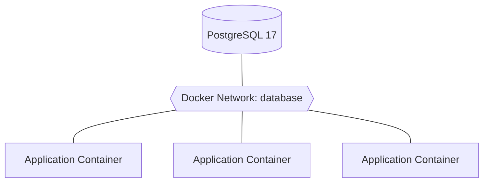
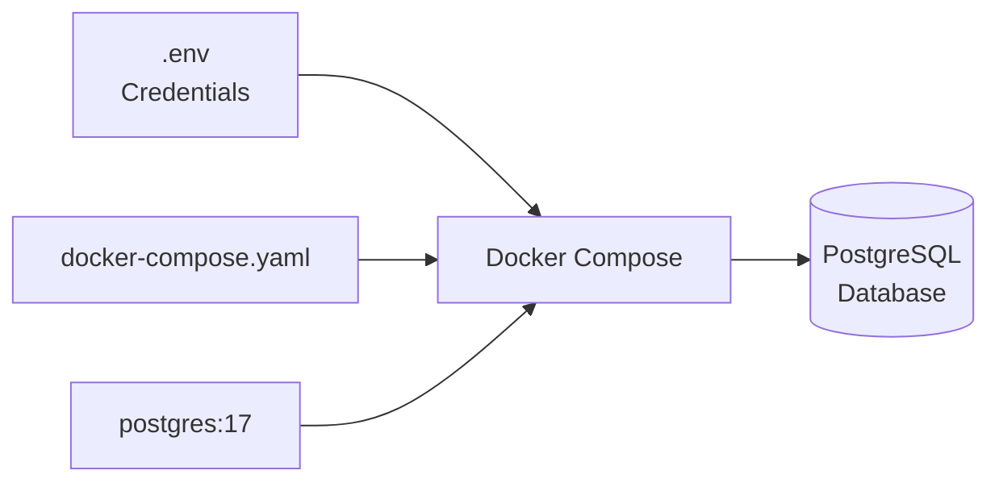
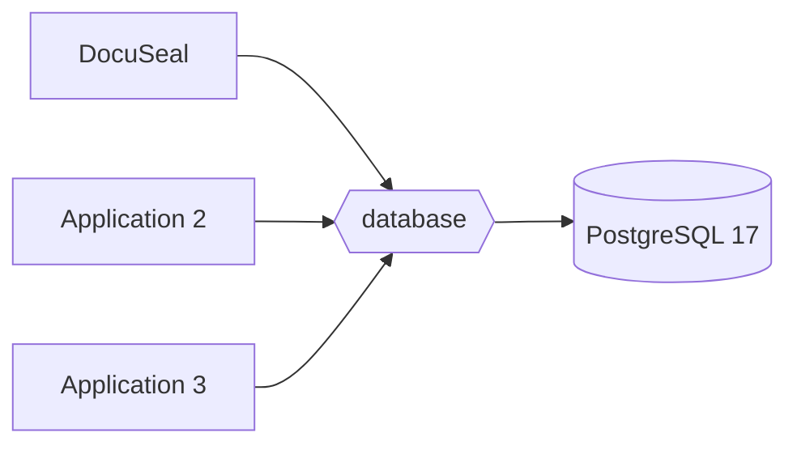

<div align="center">

# 🐘 PostgreSQL 17 — Docker Compose


**Deploy a shared PostgreSQL 17 database server for Docker applications.**


</div>

---

## 📋 Table of Contents

- [Overview](#-overview)
- [Architecture](#-architecture)
- [Prerequisites](#-prerequisites)
- [1. Change to the Installation Directory](#1-change-to-the-installation-directory)
- [2. Clone Only the PostgreSQL Directory](#2-clone-only-the-postgresql-directory)
- [3. Create the `.env` File](#3-create-the-env-file)
- [4. Generate a 64-Character Password](#4-generate-a-64-character-password)
- [5. Edit `.env` with Nano](#5-edit-env-with-nano)
- [6. Secure the `.env` File](#6-secure-the-env-file)
- [7. Verify `.env` Is Not Tracked by Git](#7-verify-env-is-not-tracked-by-git)
- [8. Launch PostgreSQL](#8-launch-postgresql)
- [9. Verify PostgreSQL](#9-verify-postgresql)
- [Connecting Other Docker Containers](#-connecting-other-docker-containers)
- [Managing the Container](#-managing-the-container)
- [Security Notes](#-security-notes)

---

## 🔎 Overview

This project deploys **PostgreSQL 17** using Docker Compose.

The PostgreSQL container is connected to a shared Docker network named `database`. Other Docker applications can join this network and use PostgreSQL without exposing TCP port `5432` to the Internet or local network.



> [!IMPORTANT]
> Each application should preferably receive its **own PostgreSQL database and database user** rather than sharing the PostgreSQL administrator account.

---

## ✅ Prerequisites

The Docker host should have:

- Docker Engine
- Docker Compose
- Git
- Nano
- Python 3
- Internet access

Verify the required commands:

```bash
docker --version
docker compose version
git --version
nano --version
python3 --version
```

---

# 1. Change to the Installation Directory

This example installs the project under `/opt`:

```bash
cd /opt
```

If your normal user does not have permission to create files there, create a working directory and assign it to your account:

```bash
sudo mkdir -p /opt/postgresql
sudo chown "$USER":"$USER" /opt/postgresql
```

Do not enter `/opt/postgresql` yet if you plan to use the sparse-clone commands in the next section.

---

# 2. Clone Only the PostgreSQL Directory

The PostgreSQL project is a **directory inside** the larger `s0nt3k/Scripts` Git repository:

```text
Scripts/
└── Docker/
    └── PostgreSQL/
        ├── README.md
        ├── docker-compose.yaml
        └── example-.env
```

Git normally clones an entire repository rather than an individual directory. Use **sparse checkout** to retrieve only the PostgreSQL directory.

From `/opt`:

```bash
cd /opt
```

Clone the repository without checking out all of its files:

```bash
git clone --filter=blob:none --no-checkout https://github.com/s0nt3k/Scripts.git postgresql-source
```

Enter the repository:

```bash
cd postgresql-source
```

Enable sparse checkout:

```bash
git sparse-checkout init --cone
```

Select only the PostgreSQL directory:

```bash
git sparse-checkout set Docker/PostgreSQL
```

Check out the `main` branch:

```bash
git checkout main
```

Enter the PostgreSQL project:

```bash
cd Docker/PostgreSQL
```

Verify the files:

```bash
ls -la
```

You should see files including:

```text
README.md
docker-compose.yaml
example-.env
```

> [!NOTE]
> The GitHub browser address ending in `/blob/...` or `/tree/...` is not a Git clone URL. Clone the repository URL `https://github.com/s0nt3k/Scripts.git` and use sparse checkout to select `Docker/PostgreSQL`.

---

# 3. Create the `.env` File

The repository contains a safe example environment file.

Copy:

```text
example-.env
```

to:

```text
.env
```

using:

```bash
cp example-.env .env
```

Verify it:

```bash
ls -la .env
```

Do **not** place the real database password in `example-.env`.

---

# 4. Generate a 64-Character Password

Use Python's cryptographically secure `secrets` module to generate the PostgreSQL password.

The following command uses characters from the printable 7-bit ASCII range while intentionally omitting characters that are troublesome in Docker Compose `.env` files or shell copy/paste operations.

```bash
python3 -c 'import secrets,string; chars=string.ascii_letters+string.digits+"!%+,-./:=?@[]^_{|}~"; print("".join(secrets.choice(chars) for _ in range(64)))'
```

Example format:

```text
xQ7@Kp...64-characters-total...9Z
```

> [!WARNING]
> Do **not** use the example above as your password. Generate a new password on your own server.

### Why not use every printable ASCII symbol?

Printable 7-bit ASCII includes characters such as spaces, quotes, `#`, backslashes and `$`. Some have special meaning in `.env` files, shells, or Docker Compose variable interpolation.

The command above still generates a password entirely from printable 7-bit ASCII characters, but uses a subset that is much safer to paste directly into:

```dotenv
POSTGRES_PASSWORD=...
```

Generate the password and copy the resulting **64-character string** to your clipboard.

---

# 5. Edit `.env` with Nano

Open the environment file:

```bash
nano .env
```

Locate:

```dotenv
POSTGRES_PASSWORD=CHANGE_ME_TO_A_LONG_RANDOM_PASSWORD
```

Delete the placeholder and paste your generated password:

```dotenv
POSTGRES_PASSWORD=YOUR_64_CHARACTER_PASSWORD
```

For example, the file should have settings similar to:

```dotenv
POSTGRES_VERSION=17

POSTGRES_CONTAINER_NAME=postgresql
POSTGRES_HOSTNAME=postgresql

POSTGRES_USER=postgres_admin
POSTGRES_PASSWORD=YOUR_64_CHARACTER_PASSWORD
POSTGRES_DB=postgres

TZ=America/Los_Angeles

POSTGRES_NETWORK_NAME=database
POSTGRES_VOLUME_NAME=postgres_data
```

## ⌨️ Nano Keyboard Shortcuts

| Action | Shortcut |
|---|---|
| Write/save the file | `Ctrl` + `O` |
| Confirm the filename | `Enter` |
| Exit Nano | `Ctrl` + `X` |
| Exit without saving | `Ctrl` + `X`, then `N` |
| Search | `Ctrl` + `W` |

After pasting the password, save and exit with:

```text
Ctrl + O
Enter
Ctrl + X
```

In Nano, the `^` symbol represents the **Ctrl** key. For example:

```text
^O = Ctrl + O
^X = Ctrl + X
```

---

# 6. Secure the `.env` File

The `.env` file contains the PostgreSQL administrator password and should not be readable by other users.

Set its permissions to `600`:

```bash
chmod 600 .env
```

Verify:

```bash
ls -l .env
```

The permissions should begin with:

```text
-rw-------
```

You can also verify the numeric permissions:

```bash
stat -c "%a %n" .env
```

Expected:

```text
600 .env
```

### What `600` Means

```text
Owner  → Read + Write
Group  → No Access
Others → No Access
```

---

# 7. Verify `.env` Is Not Tracked by Git

Your real `.env` file should **never** be committed to GitHub.

Check the repository status:

```bash
git status
```

Verify whether Git ignores `.env`:

```bash
git check-ignore -v .env
```

If `.env` is not ignored, add it to `.gitignore`:

```bash
printf '\n# Local secrets\n.env\n' >> .gitignore
```

Verify again:

```bash
git check-ignore -v .env
```

> [!CAUTION]
> If a real PostgreSQL password is accidentally committed to Git—even if you later delete the line—assume the credential has been exposed and replace it.

---

# 8. Launch PostgreSQL

From the directory containing `docker-compose.yaml` and `.env`, validate the Compose file:

```bash
docker compose config --quiet
```

If no errors are reported, launch PostgreSQL:

```bash
docker compose up -d
```

Docker will download the PostgreSQL image if it is not already installed and start the container in the background.



---

# 9. Verify PostgreSQL

Check the Compose services:

```bash
docker compose ps
```

You can also check Docker directly:

```bash
docker ps
```

The PostgreSQL container should eventually report a healthy/running state.

View recent logs:

```bash
docker compose logs --tail=100 postgresql
```

Follow logs live:

```bash
docker compose logs -f postgresql
```

Press:

```text
Ctrl + C
```

to stop following the logs. This does **not** stop PostgreSQL.

Check PostgreSQL readiness:

```bash
docker exec postgresql pg_isready
```

---

## 🔌 Connecting Other Docker Containers

Other Docker Compose projects can connect to this PostgreSQL server by joining the existing `database` network.

Example:

```yaml
services:
  application:
    image: example/application:latest

    networks:
      - database

networks:
  database:
    external: true
```

The application can then use:

```text
Host:     postgresql
Port:     5432
```

Conceptually:



> [!TIP]
> When applications communicate over the shared Docker network, PostgreSQL generally does **not** need port `5432` published to the host or Internet.

---

## 🛠️ Managing the Container

### Start

```bash
docker compose up -d
```

### Stop

```bash
docker compose stop
```

### Restart

```bash
docker compose restart
```

### View Status

```bash
docker compose ps
```

### View Logs

```bash
docker compose logs -f postgresql
```

### Stop and Remove the Container

```bash
docker compose down
```

The named PostgreSQL data volume remains unless it is explicitly removed.

> [!DANGER]
> Be careful with:
>
> ```bash
> docker compose down -v
> ```
>
> The `-v` option removes Compose-managed volumes and can destroy the PostgreSQL database data.

---

## 🔐 Security Notes

### Protect the PostgreSQL Administrator Account

The credentials in `.env` initialize a privileged PostgreSQL account. Applications should not normally share this administrator credential.

A better design is:

```text
PostgreSQL 17
│
├── Application A Database
│   └── Application A User
│
├── Application B Database
│   └── Application B User
│
└── Application C Database
    └── Application C User
```

This limits how much database access an application receives if that application is compromised.

### Protect `.env`

Always:

```bash
chmod 600 .env
```

and make sure:

```text
.env
```

is listed in `.gitignore`.

### Do Not Expose PostgreSQL Unnecessarily

If only Docker containers use PostgreSQL, avoid publishing:

```text
5432:5432
```

to the Docker host.

Keeping PostgreSQL on the internal/shared Docker network reduces unnecessary network exposure.

### Back Up the Database

The Docker volume provides **persistence**, not a backup.

A deleted/corrupted database or deleted Docker volume can still cause data loss. Maintain a separate PostgreSQL backup strategy using tools such as:

```text
pg_dump
pg_dumpall
```

and store backups separately from the Docker host when practical.

---

## ⚡ Quick Installation

```bash
cd /opt

git clone --filter=blob:none --no-checkout https://github.com/s0nt3k/Scripts.git postgresql-source
cd postgresql-source

git sparse-checkout init --cone
git sparse-checkout set Docker/PostgreSQL
git checkout main

cd Docker/PostgreSQL

cp example-.env .env

python3 -c 'import secrets,string; chars=string.ascii_letters+string.digits+"!%+,-./:=?@[]^_{|}~"; print("".join(secrets.choice(chars) for _ in range(64)))'

nano .env

chmod 600 .env

docker compose config --quiet
docker compose up -d
docker compose ps
```

---

## 🔗 Resources

- [PostgreSQL](https://www.postgresql.org/)
- [Official PostgreSQL Docker Image](https://hub.docker.com/_/postgres)
- [Docker Compose](https://docs.docker.com/compose/)
- [s0nt3k/Scripts — PostgreSQL](https://github.com/s0nt3k/Scripts/tree/main/Docker/PostgreSQL)

---

<div align="center">

### 🐘 PostgreSQL 17 + 🐳 Docker Compose

**Centralized PostgreSQL service for your Docker applications**

</div>
